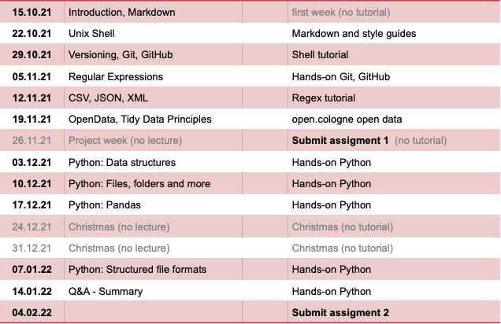

# Data Modeling 2021 (DIS08) 

## Slides and online lecture archive

All lectures will be hosted on Zoom: https://th-koeln.zoom.us/j/81513492081. The password for Zoom is the ZIP code of TH Köln @ Claudiusstraße 1. Lectures will be recorded and archived for later referal.

The following slide sets and videos are available. The password for the videos is the same as for the Zoom room.

* __01 Introduction, Markdown__ [[pdf]](slides/DIS08-01-introduction.pdf) [[video]](https://th-koeln.sciebo.de/s/oEYxPh1m6ns3nhe) [[tutorial for gitbash and repository]](tutorials/DIS08-01-introduction-gitbash_a1e1.pdf)
* __02 The Unix Shell__ [[pdf]](slides/DIS08-02-shell.pdf) [[video]](https://th-koeln.sciebo.de/s/Ffg0t2BdNYp5Xmv)
* __03 Version Control with Git and GitHub__ [[pdf]](slides/DIS08-03-git-github.pdf) [[video]](https://th-koeln.sciebo.de/s/qwqAhhebohniZtU)
* __04 RegEx__ [[pdf]](slides/DIS08-04-regex.pdf)

## Additional materials 

* [How to clean up Git mess](http://justinhileman.info/article/git-pretty/git-pretty.pdf) - Handy flowchart about how you can get out of some git mess
* [Git cheat sheet](https://education.github.com/git-cheat-sheet-education.pdf) - The most important and commonly used Git commands for easy reference
* [Sample data for Shell and RegEx testing](datasets/shell_lesson.zip)

## Assignments

You are expected to work on one exercise per week that are compiled into 2 big assignments over the semester. Compile all your results into your GitHub repository. We will gather all your results from your repositories on the day of the submission deadlines. You are not required to send anything directly to us.

1. Create a GitHub account.
2. Join the corresponding [GitHub Classroom](https://classroom.github.com/a/Nshauyhh).
3. If you can't find your student id in the classroom's list, please [file an issue](https://github.com/irgroup-classrooms/dis08-2021/issues). I just need your lastname and course of study. No student id in the public list of issues, please.

### Assignment 1

[Assignment 1](assignments.md) is a personal assignment. Each student has to compile his/her own results. The submission deadline is `2021-11-26, 20 pm`. All parts of assignment 1 are pre-released so that you can look ahead what's coming up in the next weeks. 

## Open questions and FAQ in the GitHub discussion forum

Please feel free to comment on all the slides available. Open up a ticket if you find anything I should update or fix. 

Please open up a [discussion post](https://github.com/irgroup-classrooms/dis08-2021/discussions) in this repository if there are any questions or issues related to the slides, lectures or assignments. Feel free to comment and post you own entries to this discussion forum.

## Syllabus

The following syllabus is an overview on the topics I plan to cover in this semester. Stay tuned!

## Fun

* Programing: Expectations vs Reality [[imgur](https://imgur.com/gallery/laOofrv)]
